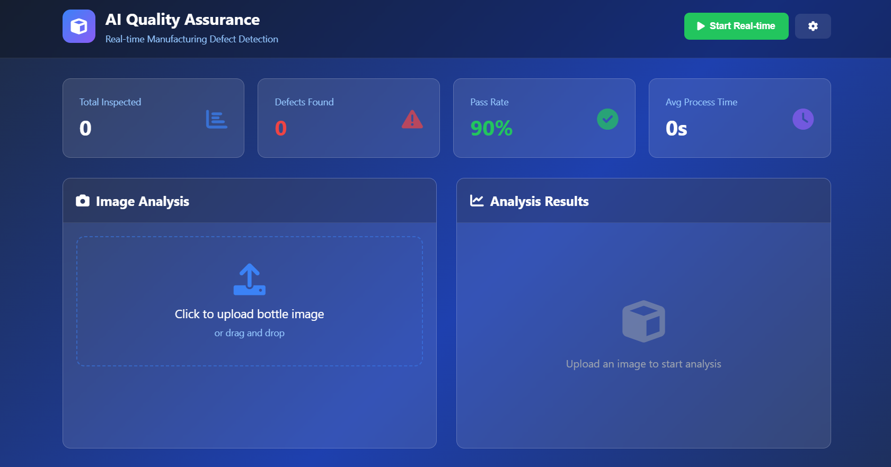
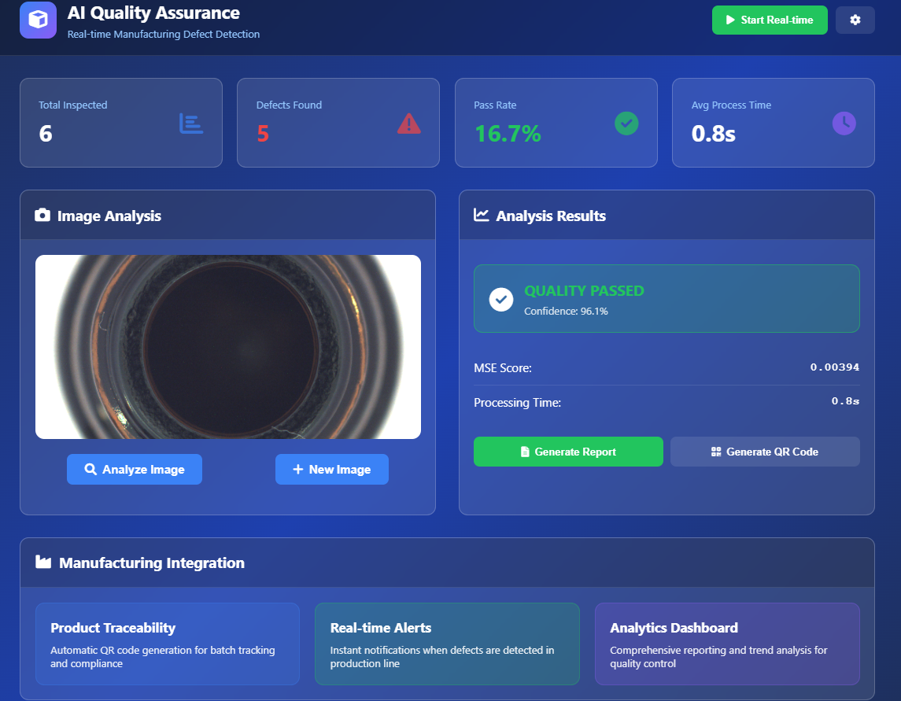
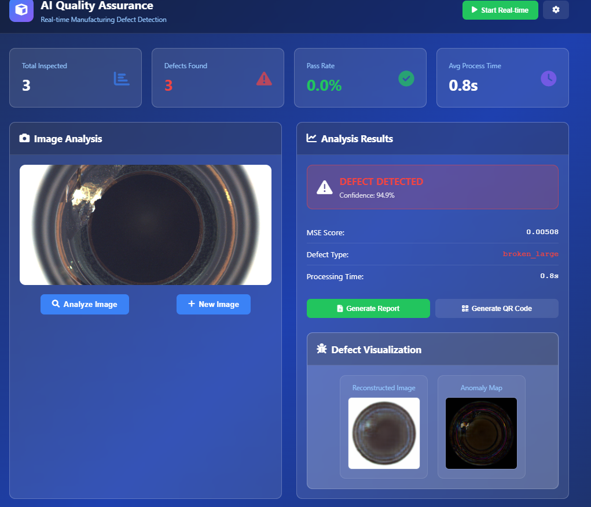
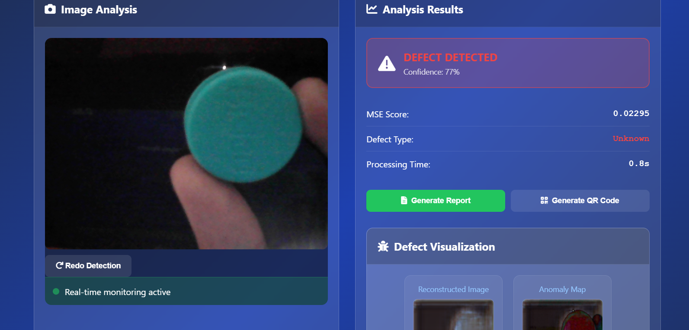

# AI Quality Assurance - Real-Time Defect Detection System

This project is focused on real-time defect detection in manufacturing using computer vision.

---

## 🚀 Overview

An end-to-end AI-powered quality assurance system that:

* Detects visual defects in manufacturing (bottle caps/necks) using autoencoders
* Works in real-time using webcam or uploaded images
* Generates reports and QR codes for traceability
* Visualizes reconstructions and anomaly maps for insights

---

## 🧠 Core Features

* 🔍 **Real-time Anomaly Detection** (autoencoder + MSE)
* 📷 **Camera & Image Upload Support**
* 📈 **Live Confidence Scoring**
* 🧾 **Automated Report Generation**
* 📦 **Unique QR Code for Traceability**
* 🧊 **Freeze-Frame Analysis + Redo Button**
* 📊 **Defect Visualization: Original vs Reconstructed**

---

## 📷 Application Preview

### Dashboard

*Dashboard*

### Quality Passed 

*Quality Pass*

### Defective 

*Defective Image Screen with Visuals*

### Real-Time Checking 

*Real-Time Checking with visuals*

---

## 📸 Demo

> 📹 [Demo Video Link](https://drive.google.com/file/d/1341ylmE9YRooJKVBdhgBntuZe_i0_GeF/view?usp=drivesdk) <br>
> 💫 [Live Project Link](https://ai-quality-assurance.vercel.app/)

---

## 📂 Folder Structure

```bash
├── app.py                         # Flask backend server
├── script.js                     # Frontend logic
├── style.css                     # UI styling
├── index.html                   # Main dashboard UI
├── train_autoencoder_bottle.py   # Model training script
├── detect_anamolies_bottle.py    # Model evaluation logic
├── bottle_autoencoder.h5         # Pre-trained model
├── product_traceability_bottle_log.csv # Product history log
├── qr_codes_bottle/              # Generated QR codes
└── bottle/                       # MVTec dataset (test images)
```

---

## ⚙️ How It Works

1. Flask backend receives image via upload or webcam frame.
2. The image is preprocessed (resized, normalized).
3. Autoencoder reconstructs it; MSE is calculated.
4. Threshold is applied to determine defect.
5. UI updates results, visualizations, and allows QR/report generation.

---

## 🧪 Tech Stack

* **Frontend:** HTML5, CSS3, JavaScript (Vanilla)
* **Backend:** Python Flask
* **AI Model:** TensorFlow Autoencoder
* **Visualization:** Matplotlib + Base64 for web
* **Data Storage:** CSV

---

## 🏗️ Setup Instructions

```bash
# 1. Clone the repo
$ git clone https://github.com/yourusername/ai-quality-inspection
$ cd ai-quality-inspection

# 2. Install dependencies
$ pip install -r requirements.txt

# 3. Train (Optional)
$ python train_autoencoder_bottle.py

# 4. Run app
$ python app.py

# 5. Open browser
Visit http://127.0.0.1:5000/
```

---

## 📌 Limitations & Next Steps

* Current model works well with MVTec dataset
* Real-world webcam accuracy may vary (needs fine-tuning or retraining)
* Real-time prediction is enhanced with freeze-frame + manual re-detect
* Future improvement: YOLO-based cap detection, cloud traceability
* The live link as mentioned in the repository is for the frontend only. To connect it with backend is pending.

---

## 🧠 Authors & Acknowledgements

* Developed by - CodeClan
* Special thanks to the **Cyfuture Hackathon 1.0** team for this opportunity
* Dataset from [MVTec Anomaly Detection Dataset](https://www.mvtec.com/company/research/datasets/mvtec-ad)

---

## 📄 License

This project is licensed under the [MIT License](LICENSE).  
You are free to use, modify, and distribute this software for personal or commercial purposes, **as long as proper credit is given to the original author**.

Please do not remove the original license or claim authorship.  
For attribution, retain the following:
© 2025 preritasaini1

---

> Made with ❤️ for the future of smart manufacturing.
